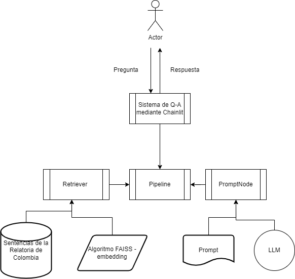
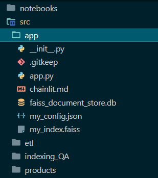

# Hacktoberfest 2023: Construcción de pipelines Retrieval Augmented Generation (RAG)con open source 


## Aplicación de preguntas y respuestas de sentencias de altas cortes de Colombia usando Haystack 


<details>
  <summary>  Contexto </summary>

Colombia es un Estado Social de Derecho, se divide el poder en las clásicas 3 ramas del poder público; ejecutivo, legislativo, judicial, más otros órganos como la Procuraduría y Contraloría.

La Rama Judicial resuelve las controversias que se dan entre los ciudadanos, sea de carácter civil, administrativo, familiar, laboral, agrario, etcétera.

Dentro de la Constitución de 1991 se incluyó la Acción de tutela, [que tiene equivalentes en otros países](https://repository.unilibre.edu.co/bitstream/handle/10901/23071/LA%20ACCI%C3%93N%20DE%20TUTELA%20COMPARADA%20CON%20OTROS%20PROCEDIMIENTOS%20DE%20AMPARO%20ESTABLECIDOS%20EN%20AM%C3%89RICA%20LATINA.pdf?sequence=2), la cual mediante un trámite de 10 días hábiles resuelve la protección de derechos fundamentales, tales como: salud, vida, educación, acceso a la información, dignidad.

Si una persona siente o cree que se le viola o vulnera un derecho necesita, o contratar un abogado, recurrir a la defensoría del pueblo o a un consultorio jurídico de una universidad. Muchas veces contratar a un abogado es ya una barrera a la administración de justicia si el interesado no puede costearse los honorarios. La defensoría del pueblo que ofrece asesoría gratuita, esta congestionada por la cantidad de usuarios necesitados. Los consultorios jurídicos de universidades cesan la atención durante el período de vacaciones de los estudiantes.

Aunque se exhorta a los jueces redacción de sentencias de [lectura fácil](https://www.ambitojuridico.com/noticias/administrativo/congreso-crearia-formato-de-sentencias-de-lectura-facil) , es inevitable el uso de tecnicismo, y las personas no abogadas no sabrían a cuales sentencias prestarle atención entre el mar de jurisprudencia.

Por lo anterior, una aplicación de preguntas y respuestas (QA) es valiosa para una persona que se cree inmersa en una circunstancia de violación de derechos porque puede, con solo consignar lo que le pasa -los hechos- , conocer si previamente, alguna sentencia ha protegido un derecho fundamental en un caso similar.

</details>

<details>
  <summary>  Definiciones preliminares </summary>

## Construccion del ETL y RAG pipelines  
RAG (Retrieval-Augmented Generation) es un patrón de diseño/framework de Inteligencia Artificial diseñado para mejorar el rendimiento de los Grandes Modelos de Lenguaje (LLM). Su objetivo principal es proporcionar información precisa y verificable sin incurrir en altos costos computacionales o financieros asociados con el entrenamiento continuo de los modelos de lenguaje en nuevos datos.
La necesidad de RAG surgió debido a las limitaciones inherentes a los LLM. Aunque estos modelos son poderosos y capaces de generar respuestas impactantes, a menudo carecen de precisión y exactitud. Los LLM pueden entender las relaciones estadísticas entre las palabras, pero el significado real de estas palabras a menudo se pierde en el proceso. Además, los LLM a veces proporcionan información aleatoria y no relacionada en respuesta a consultas, también conocida como alucinaciones.

</details>
<details>
  <summary> La solución implementada</summary>

### Objetivo:

Construcción de una aplicación para realizar preguntas relacionadas a decisiones y  jurisprudencia de las cortes de Colombia usando Haystack como framework de desarrollo de aplicaciones de uso de modelos de lenguaje grande (LLM) y Chainlit como herramienta de contrucción de la interfaz de usuario final. 
 
<br></br>

 

<br></br>
Para esta implementación se ha usado las siguientes plataformas/tecnologías/frameworks:  
Python, [Ploomber](https://ploomber.io/),`[FAISS](https://faiss.ai/index.html), [Haystack](https://haystack.deepset.ai/), [Chainlit](https://docs.chainlit.io/get-started/overview), [Docker](https://www.docker.com/), [Poetry](https://python-poetry.org/), [Miniconda](https://docs.conda.io/projects/miniconda/en/latest/)


#### Conjunto de datos Fuente:
- Subconjunto de sentencias de la relatoría de cortes de Colombia: 
[Relatorìa de Colombia](https://www.corteconstitucional.gov.co/relatoria/)
- Licencia: Pública por ser decisiones judiciales y su uso sería equivalente a la [licencia GNU 3.0](https://es.wikipedia.org/wiki/GNU_General_Public_License)

#### Implementación
Se ha realizado una primera etapa de implementación y se espera continuar en un segunda etapa

El alcance de la solución de esta primera etapa incluye:  

- Uso de un subconjunto de 34 sentencias representativas del año 2022
- Uso de la biblioteca FAISS para almacenar los documentos de sentencia indexados y vectorizados
- Uso de GPT-4 de OpenAI como modelo de lenguaje grande para hacer preguntas sobre el conjunto de sentencias
- Desarrollo de un script que descarga las sentencias de la corte desde el sitio web de la relatoría en formato RTF y las transforma en archivos de texto
- Desarrollo de un script que indexa y almacena las sentencias en un FAISS Document Store usando Haystack como framework
- Desarrollo de un script que carga el FAISS Document Store previamente generado para realizar preguntas usando Haystack como framework
- Desarrollo de un aplicación Chainlit para interfaz de usuario final
- Creación de un contenedor de Docker que encapsula la solución a ser desplegada en la nube de Ploomber
- Creación de un pipeline de Ploomber para desplegar la solución a la nube de Ploomber

Este repositorio mantiene tanto los scripts mencionados anteriormente como los archivos asociados al FAISS Document Store con las sentencias seleccionadas como prueba, estos son: *Faiss_document_store.db, my_index.faiss y my_config.json*

#### El repositorio se ha organizado en las carpetas

. 

- En la carpeta **notebooks** se encuentran los notebooks preliminares a la creación de los scripts 
- En la carpeta **src/app** se encuentra el script *app.py*, que contiene tanto   el script  que realiza las preguntas, construido con Haystack, como la interfaz de usuario construida usando Chaintlit.
- En la carpeta **etl** se encuentra el script *extract.py* que realiza la descarga de las sentencias del sitio web de la relatoria, en formato rtf y los convierte a documentos en formato texto.
- En la carpeta **indexing_QA**, se encuentran los scripts *indexing_documents.py* y *qa_generation.py*, los cuales realizan por separado los procesos de creación del Document Store con la indexacion de las sentencias y el proceso de preguntas 


</details>

<details>
  <summary>  Como ejecutar la aplicación en la web </summary>
<p> </p>

La aplicación se encuentra desplegada en la plataforma de **Ploomber**  
Se puede acceder en el enlace: [Tutelai](https://proud-bird-8701.ploomberapp.io/)
<p> </p>
</details>

<details>
  <summary>  Como ejecutar la aplicación localmente </summary>  

### Instalación y Configuración

Se puede ejecutar por separado,la aplicación de preguntas, el proceso de generación del Document Store o el proceso de descarga de sentencias desde el sitio de la relatoria de Colombia.

<p></p>
Para la ejecución de la aplicación de preguntas se requiere:

- Que en la carpeta **src/app** existan los archivos correspondientes al Document Store de prueba: *faiss_document_store.db, my_config.json y my_index.faiss*
- La configuración del archivo de .env con la API Key de Open AI

Este repositorio contiene un FAISS Document Store, por lo que en principio, no es necesario ejecutar los procesos de descarga de sentencias ni de generación de Document Store.  

Una vez se haya descargado el repositorio, se puede hacer la configuración mediante *Poetry* o instalando las dependencias desde el archivo *requirements.txt*.

#### Instalación con Poetry

Se asume que ya se tiene instalada Miniconda o Anaconda para crear el entorno.
(consultar el [Setup](https://github.com/MentoriaPloomber/RAG_HayStack_QA/blob/main/setup-espanol.md))

1. Creando nuevo entorno en la carpeta donde se encuentra el repositorio del proyecto
  ```console
    conda create --name tutelai python=3.10
  ```

2. Activando el entorno
  ```console
    conda activate tutelai 
  ```
3. Instalando poetry 
  ```console
    pip install poetry
  ```

4. Instalando dependencies
  ```console
    poetry install
  ```

### Ejecución de la aplicación Chainlit, interfaz de usuario para las preguntas

Una vez se haya hecho la instalación del entorno con las dependencias, se puede ejecutar la aplicación de preguntas con el FAISS Document Store de prueba que incluye este repositorio

1. Configurando la API key de OpenAI  
   En la carpeta **src/app**, crear el archivo .env e incluir la variable con el API key   
 
  ```console
     OPENAI_API_KEY='<id>'
  ```
2. Ejecutando la aplicacion Chainlit localmente
   En la carpeta src/app ejecutar: 
  ```console
     chainlit run app.py -w
  ```
  Esto abrirá una pestaña en el navegador con la interfaz donde se podrán escribir las preguntas.   

  **Ejemplos de preguntas:**  
  - ¿Como se viola el derecho al trabajo?  
  - ¿Las tutelas protegen la diversidad sexual?  

### Ejecución de la descarga de las sentencias de la relatoria

Para poder ejecutar la descarga automática de las sentencias, en la carpeta **src/etl**, ejecutar   

  ```console
     extract.py
  ```
Este genera un carpeta con las sentencias en formato .txt las cuales son el insumo para la indexación y creación del FAISS Document Store

### Ejecución de la creación del Document Store

Para poder ejecutar la creación del FAISS Document Store, en la carpeta **src/indexing_QA**, ejecutar 
  ```console
     indexing_documents.py
  ```
Este script toma como insumo la carpeta de sentencias en formato .txt creada por el script de descarga de las sentencias *extract.py* y genera los archivos que son insumo para la aplicación de preguntas y respuestas: *faiss_document_store.db, my_config.json y my_index.faiss*  

</details>

## Miembros del equipo

[Elka Buitrago](https://github.com/elkabuitrago)
[Juan Vázquez Montejo](https://github.com/juanvazqmont)
[María Carolina Passarello](https://github.com/caropass)
[Sergio Maldonado Rodríguez](https://github.com/SergioRodMa)
[Anuar Menco Nemes](https://github.com/anuarmenco) 