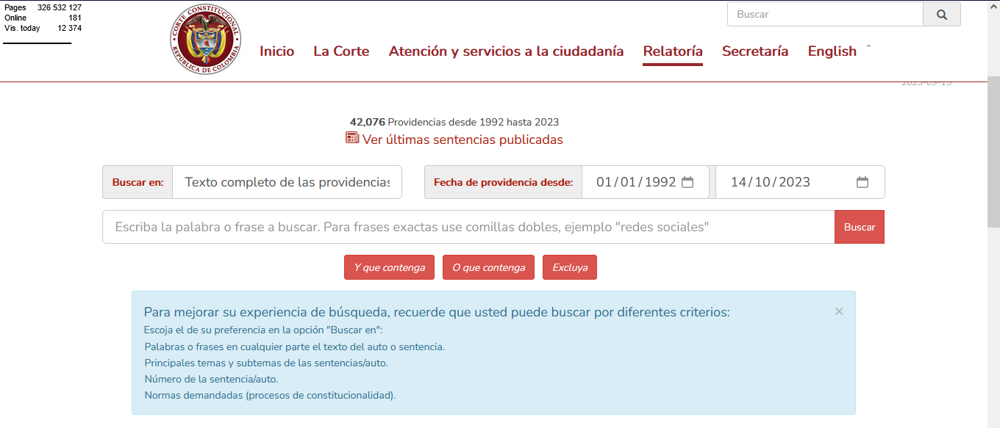

# Construccion del ETL y RAG pipelines

## Configuración

Para poder ejecutar la descarga automatica de documentos es necesario ejecutar el archivo `extract.py`

Este contiene todas las funciones necesarias para la descarga automtica de documentos, que en este proyecto, son sentencias del pais de Colombia, las cuales se descargan del siguiente sitio:

[https://www.corteconstitucional.gov.co/relatoria/]()

Este sitio cuenta con su propio buscador en el cual se pueden filtrar sentencias por medio de palabras claves y/o rango de fechas.

Debido a que el sitio de busqueda es un poco complicado de manejar y automatizar se desarrollo una funcion `get_url_by_year` la cual descarga los documentos por medio de listas de años, es decir si le pasamos a la funcion una lista de años `[2021,2022]` esta descargara todas las sentencias de estos dos años. Todos los archivos descargados se guardaran en una carpeta llamada `Data_sentencias`. Por default la funcion funciona con la descarga de sentencias del año 2022. De igual forma unicamente se tiene informacion de sentencias hasta el año 2022 para su descarga automatica.

Para generar un informe mas especifico de la descarga y ver el procedimiento con el cual de desarollo esta descarga automatica se puede revisar el siguiente [notebook](../notebooks/descarga_url_de_sentencias_en_txt.ipynb)

Adicionalmente se incluyo una funcion con la cual se puede visualizar el contenido de alguno de los documentos descargados

`read_txt_file(direccion_del_archivo)`

## Team members/ Miembros del equipo

[Elka Buitrago](https://github.com/elkabuitrago)
[Juan Vázquez Montejo](https://github.com/juanvazqmont)
[María Carolina Passarello](https://github.com/caropass)
[Sergio Maldonado Rodríguez](https://github.com/SergioRodMa)
[Anuar Menco Nemes](https://github.com/anuarmenco)
