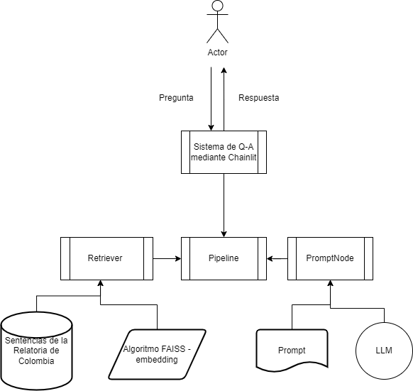

# En esta documentación encontrarás
- Definiciones preliminares
- La solución implementada
- Como accesar la aplicación en la web
- Como ejecutar la aplicación localmente

<p></p>
<details>
  <summary>  Definiciones preliminares </summary>

## Construccion del ETL y RAG pipelines  
RAG (Retrieval-Augmented Generation) es un patrón de diseño/framework de Inteligencia Artificial diseñado para mejorar el rendimiento de los Grandes Modelos de Lenguaje (LLM). Su objetivo principal es proporcionar información precisa y verificable sin incurrir en altos costos computacionales o financieros asociados con el entrenamiento continuo de los modelos de lenguaje en nuevos datos.
La necesidad de RAG surgió debido a las limitaciones inherentes a los LLM. Aunque estos modelos son poderosos y capaces de generar respuestas impactantes, a menudo carecen de precisión y exactitud. Los LLM pueden entender las relaciones estadísticas entre las palabras, pero el significado real de estas palabras a menudo se pierde en el proceso. Además, los LLM a veces proporcionan información aleatoria y no relacionada en respuesta a consultas, también conocida como alucinaciones.

</details>
<details>
  <summary> La solución implementada</summary>

## Aplicación de preguntas y respuestas de sentencias de corte de Colombia usando Haystack  
<br></br>

 

<br></br>
Para esta implementación se ha usado las siguientes plataformas/tecnologías/frameworks:  
Python, [Ploomber](https://ploomber.io/),`[FAISS](https://faiss.ai/index.html), [Haystack](https://haystack.deepset.ai/), [Chainlit](https://docs.chainlit.io/get-started/overview), [Docker](https://www.docker.com/), [Poetry](https://python-poetry.org/), [Miniconda](https://docs.conda.io/projects/miniconda/en/latest/)

### Objetivo:

Construir una aplicación que pueda realizar preguntas relacionadas a decisiones y  jurisprudencia de las cortes de Colombia usando Haystack como framework de desarrollo de aplicaciones de uso de modelos de lenguaje grande (LLM)

#### Conjunto de datos Fuente:
Subconjunto de sentencias de la relatoría de cortes de Colombia: 
[Relatorìa de Colombia](https://www.corteconstitucional.gov.co/relatoria/)


Se ha realizado una primera etapa de implementación y se espera continuar en un segunda etapa

El alcance de la solución de esta primera etapa incluye:  

- Uso de un subconjunto de 34 sentencias representativas del año 2022
- Uso de la biblioteca FAISS para almacenar los documentos de sentencia indexados y vectorizados
- Uso de GPT-4 de OpenAI como modelo de lenguaje grande para hacer preguntas sobre el conjunto de sentencias
- Desarrollo de un script que descarga las sentencias de la corte desde el sitio web de la relatoría en formato RTF y las transforma en archivos de texto
- Desarrollo de un script que indexa y almacena las sentencias en un FAISS Document Store usando Haystack como framework
- Desarrollo de un script que carga el FAISS Document Store previamente generado para realizar preguntas usando Haystack como framework
- Desarrollo de un aplicación Chainlit para interfaz de usuario final
- Creación de un contenedor de Docker que encapsula la solución a ser desplegada en la nube de Ploomber
- Creación de un pipeline de Ploomber para desplegar la solución a la nube de Ploomber

Este repositorio mantiene tanto los scripts mencionados anteriormente como los archivos asociados al FAISS Document Store con las sentencias seleccionadas como prueba, estos son: *Faiss_document_store.db, my_index.faiss y my_config.json*

#### El repositorio se ha organizado en las carpetas

. 

- En la carpeta **notebooks** se encuentran los notebooks preliminares a la creación de los scripts 
- En la carpeta **src/app** se encuentra el script *app.py*, que contiene tanto   el script  que realiza las preguntas, construido con Haystack, como la interfaz de usuario construida usando Chaintlit.
- En la carpeta **etl** se encuentra el script *extract.py* que realiza la descarga de las sentencias del sitio web de la relatoria, en formato rtf y los convierte a documentos en formato texto.
- En la carpeta **indexing_QA**, se encuentran los scripts *indexing_documents.py* y *qa_generation.py*, los cuales realizan por separado los procesos de creación del Document Store con la indexacion de las sentencias y el proceso de preguntas 


</details>

<details>
  <summary>  Como ejecutar la aplicación en la web </summary>

</details>

<details>
  <summary>  Como ejecutar la aplicación localmente </summary>  

### Instalación y Configuración

Se puede ejecutar por separado,la aplicación de preguntas o el proceso de generación del Document Store.  
Para la ejecución de la aplicación de preguntas se requiere que en la carpeta **src/app** existan los archivos correspondientes al Document Store de prueba: *faiss_document_store.db, my_config.json y my_index.faiss*


Una vez se haya descargado el repositorio, se puede hacer la configuración utilizando *Poetry, Docker* o instalando las dependencias desde el archivo *requirements.txt*.

#### Instalación con Docker


#### Instalación con Poetry

Se asume que ya se tiene instalada Miniconda o Anaconda para crear el entorno.

1. Creando nuevo entorno en la carpeta donde se encuentra el repositorio del proyecto
  ```console
    conda create --name tutelai python=3.10
  ```

2. Activando el entorno
  ```console
    conda activate tutelai 
  ```
3. Instalando poetry 
  ```console
    pip install poetry
  ```

4. Instalando dependencies
  ```console
    poetry install
  ```

### Ejecución de la aplicación Chainlit de interfaz para las preguntas

Una vez se haya hecho la instalación del entorno con las dependencias 

1. Configurando la API key de OpenAI  
   En la carpeta **src/app**, crear el archivo .env e incluir la variable con el API key   
 
  ```console
     OPENAI_API_KEY='<id>'
  ```
2. Ejecutando la aplicacion Chainlit localmente
   En la carpeta src/app ejecutar: 
  ```console
     chainlit run app.py -w
  ```
  Esto abrirá una pestaña en el navegador con la interfaz donde se podrán escribir las preguntas.   

  **Ejemplos de preguntas:**  
  - ¿Como se viola el derecho al trabajo?  
  - ¿Las tutelas protegen la diversidad sexual?  

### Ejecución de la descarga de las sentencias de la relatoria

Para poder ejecutar la descarga automatica de documentos es necesario ejecutar el archivo `extract.py`

Este contiene todas las funciones necesarias para la descarga automática de documentos, que en este proyecto, son sentencias del pais de Colombia

</details>


### Team members/ Miembros del equipo

[Elka Buitrago](https://github.com/elkabuitrago)
[Juan Vázquez Montejo](https://github.com/juanvazqmont)
[María Carolina Passarello](https://github.com/caropass)
[Sergio Maldonado Rodríguez](https://github.com/SergioRodMa)
[Anuar Menco Nemes](https://github.com/anuarmenco)

